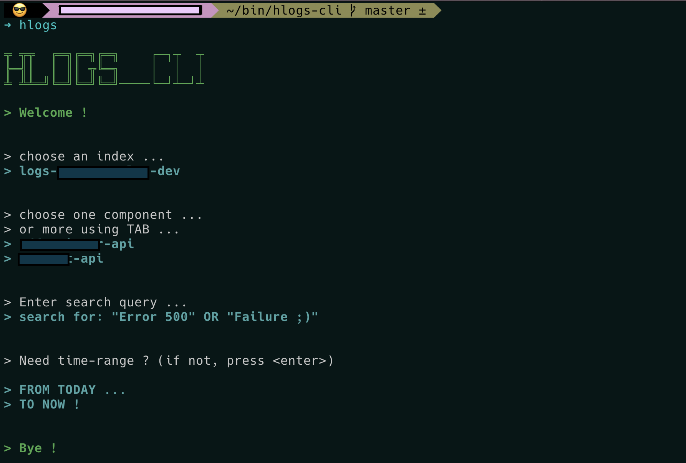

# Description

A tiny tool meant to easily accesss "H" Kibana in the browser and watch logs.
Currently only working on MacOS.

# Requirements (macOS)
- fzf ([brew](https://formulae.brew.sh/formula/fzf#default))

# Configuration 

- `.env` (mandatory). You can use `.env.local` as a model

# Security

- ensure your VPN is active (as usual for logs)

# Layout suggestion

- For improved layout with fzf, you may add in your `.zshrc` or `.bashrc` the following

`export FZF_DEFAULT_OPTS='--height 50% --layout=reverse'`
